# Norman doors

## ✍🏼 Low fidelity

Excalidraw

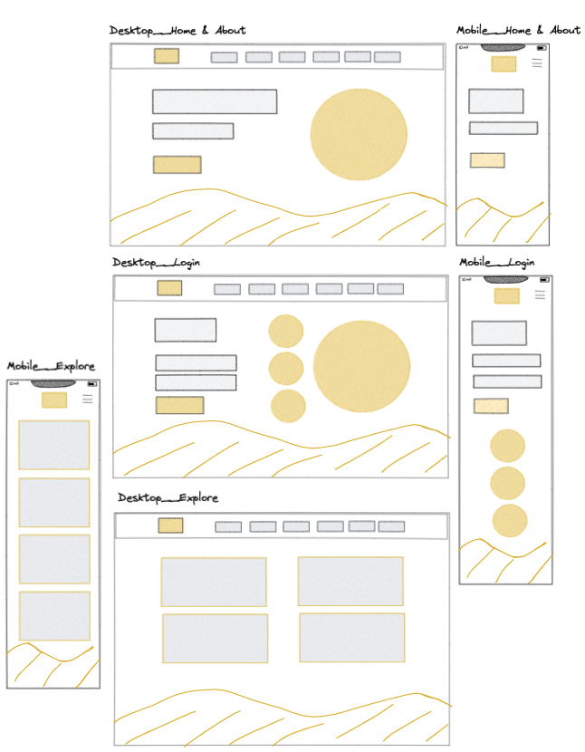

Components hierarchy (e.g. for Home page, path: / )

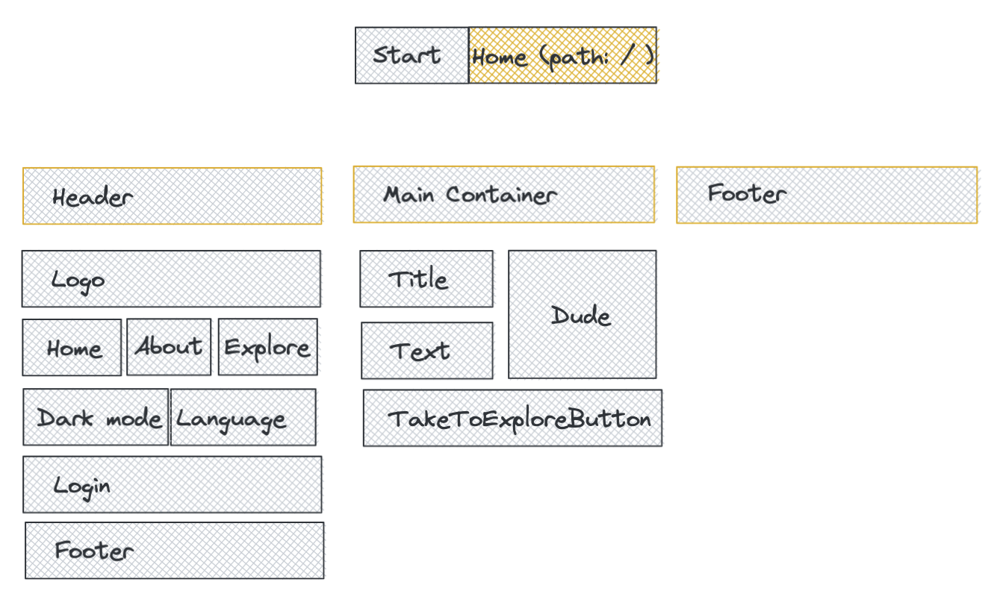

## 🎨 High fidelity

Design system+color palette

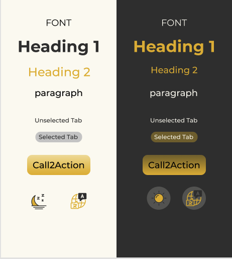

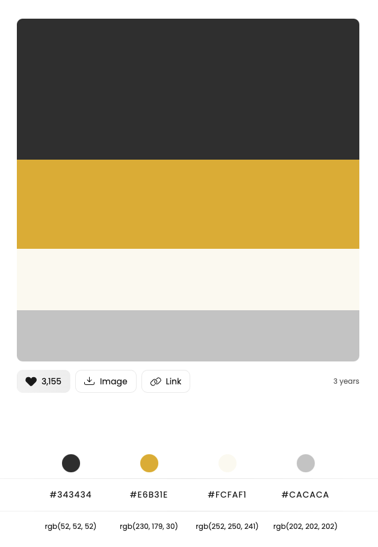

Figma

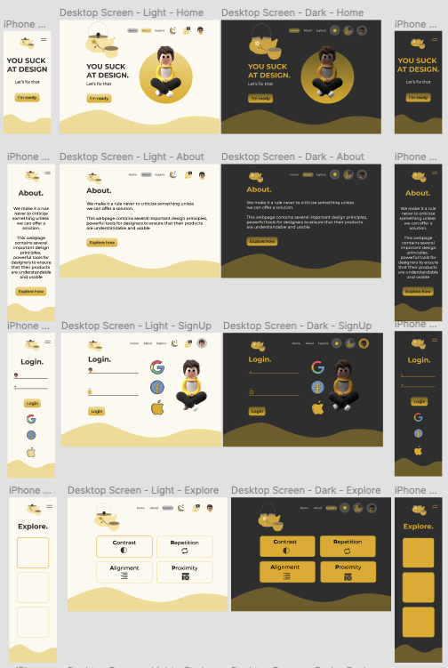

## 🖥️ Implementation

Try it out: [https://noorman-doors.vercel.app/](https://noorman-doors.vercel.app/)

## ✅ Evaluation

In the process of making this app I made sure to follow basic UX/UI principles in both the app and the code that I’ve learned in class Human Computer Interaction such as

### 🪴 Norman’s design principles

1. Visibility
2. Feedback
3. Constraints
4. Mapping
5. Consistency
6. Affordance
7. Mental models

### 👁️ Usability heuristics

1. Match between system and the real world
2. Consistency and standards
3. Visibility of system status
4. User control and freedom
5. Error prevention
6. Help user’s recognize, diagnose and recover from errors
7. Recognition rather than recall
8. Flexibility and efficiency of use
9. Aesthetic and minimalist design
10. Help and documentation

### 💩 CRAP principles ( also a topic of this app)

1. Contrast
2. Repetition
3. Alignment
4. Proximity

## 🏃🏻‍♂️ Going the extra mile

### Custom CSS  - no framework whatsoever

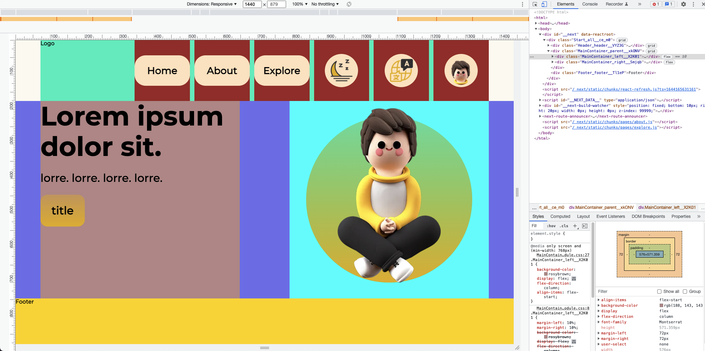

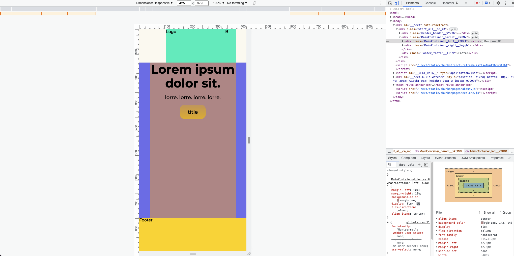

### _document.js file for SEO

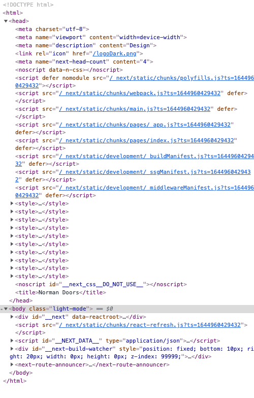

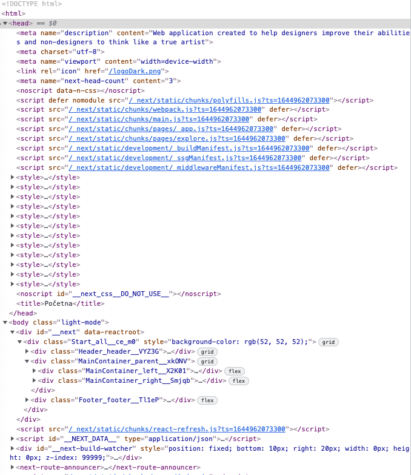

### Color blindness covered

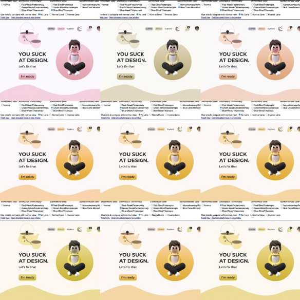

### Support dark mode

Visible on high fidelity images in this README

### Support multiple languages -> eng+cro

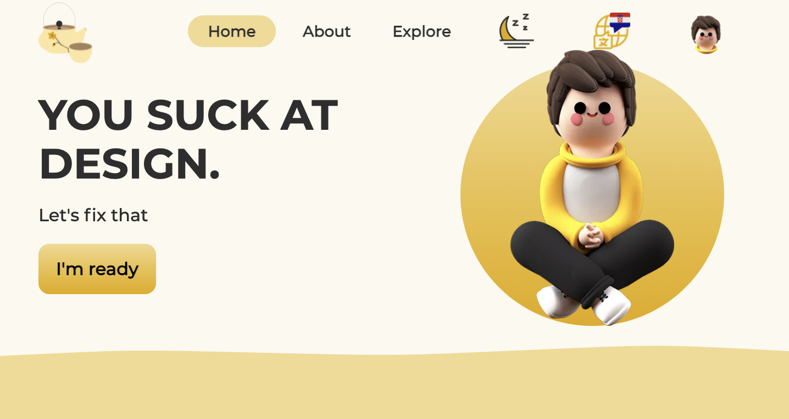

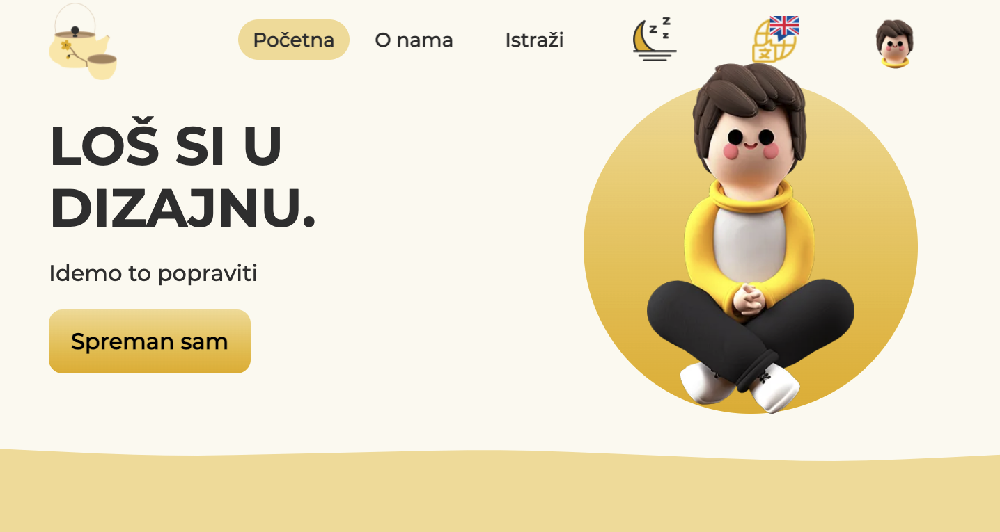

### 404 page - custom

With dark mode and language mode in mind and with a safety net button (not on image) in place 

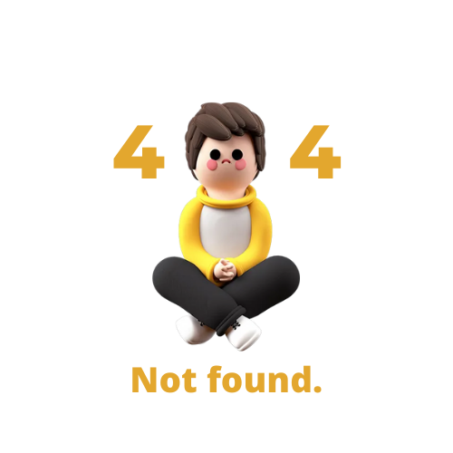

### **Measured page quality**

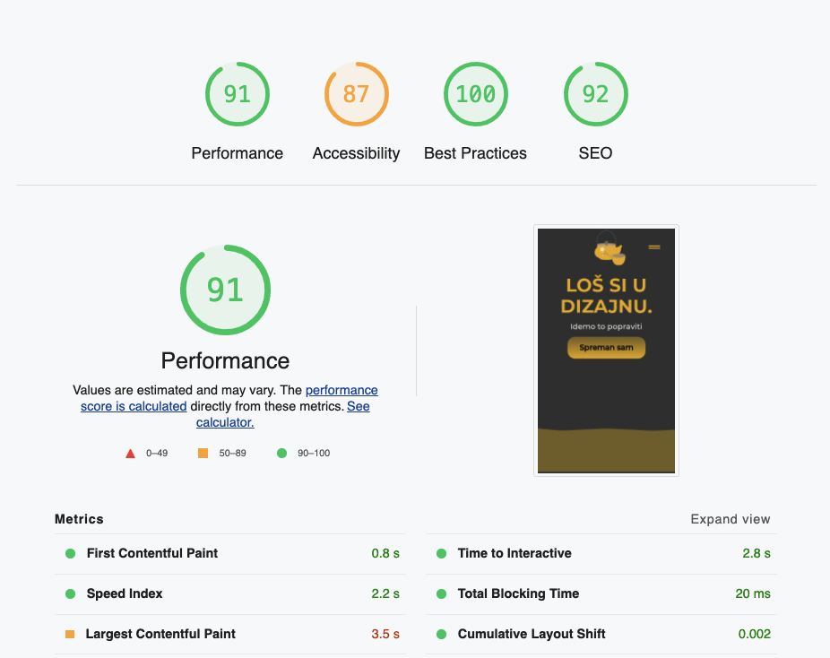
